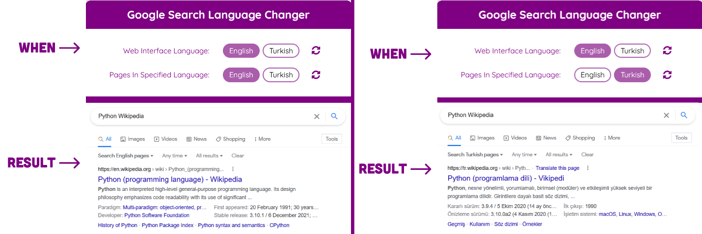

# Google Search Language Changer

Translations:

- [Türkçe Açıklama İçin Tıklayın](translations/TURKISH.md)

**Google Search Language Changer** is an extension that allows you to quickly change your Google Search language preferences such as **pages in the specified language** and **web interface language**.

---

### Explanation

#### This extension is NOT a TRANSLATION extension.

Let's say you want to search **Python Wikipedia** on Google. The results will appear in your native language. This extension allows you to **switch languages** so you can search for the same content in different languages.

For example:

