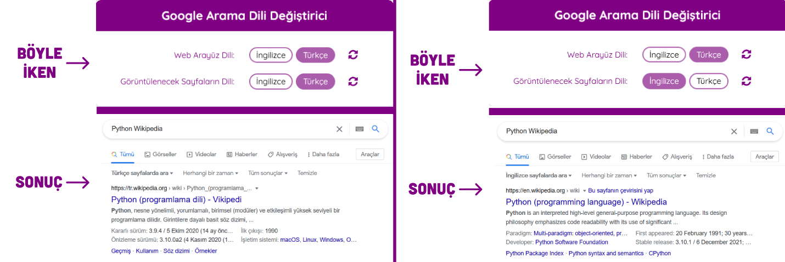

# Google Arama Dili Değiştirici

<!-- **Google Search Language Changer** is an extension that allows you to quickly change your Google Search language preferences such as **pages in the specified language** and **web interface language**. -->

**Google Arama Dili Değiştirici** hızlı bir şekilde Google arama dili tercihlerinizi değiştirebilmenizi sağlayan bir eklentidir. Örneğin, **karşınıza çıkacak sayfaların dilini** ve **web arayüz dilini** değiştirebilmenizi sağlar.

---

### Açıklama

#### Bu eklenti bir ÇEVİRİ eklentisi DEĞİLDİR.

Google'da **Python Wikipedia** sözcüğünü arattığınızı farzedelim. Karşınıza çıkan sonuçlar sizin ana dilinizde olacaktır. Bu eklenti, aynı içeriği farklı dillerde arayabilmeniz için **diller arasında kolayca geçiş** yapabilmenizi sağlar.

Örneğin:

